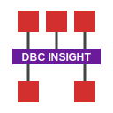

# DBC Insight

VS Code extension providing diagnostics and a powerful graphical preview for CAN DBC files. Forked and rebooted from the original DBC Language Syntax extension.

## 🌟 Key Features

### 🌳 Professional Sidebar Navigation
Explore your CAN network with a foldable tree structure. Messages are automatically grouped by transmitter (TX) and receiver (RX) for every node.

### 🔍 Smart "Jump to" Search
Find any node, message, or signal instantly. Search by Name, Decimal ID, or Hex ID. Clicking a result instantly navigates to its details and auto-expands the tree.

### 📊 Interactive Bit Matrix
Visualize exactly how signals are packed into messages. Supports both **Intel (Little Endian)** and **Motorola (Big Endian)** layouts with interactive start-bit highlighting.

### 📋 Full Metadata Support
Detailed property grids for all objects, including **Value Tables** (enums), units, factors, offsets, and comments.

## 🚀 Usage
1. Open a `.dbc` file in VS Code.
2. Click the **DBC Insight** icon in the editor title bar (top right).
3. Browse the tree or use the search bar to inspect your database.

---

## 📸 Media & Demos

### Syntax Highlighting & Validation

*Provides professional syntax highlighting and real-time parser/lexer diagnostics.*

### Interactive Preview

*The new sidebar with foldable tree and jump-to search.*

### Code Snippets

*Built-in snippets for common DBC objects (Messages, Signals, Nodes).*

---

## 🛠 Project Organization
- **`dbcLib`**: Core library containing the data models and binary serialization logic.
- **`server`**: Language Server Protocol (LSP) implementation using Jison for parsing.
- **`client`**: VS Code extension host and the React-based preview panel.

## 🤝 Third Party Libraries
- [jison](https://github.com/zaach/jison) - Parser generator.
- [React.js](https://reactjs.org/) - Frontend UI.
- [MessagePack](https://msgpack.org/) - Efficient binary serialization.

## ⚖ License
GNU General Public License v2.0 only.
