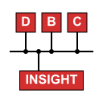
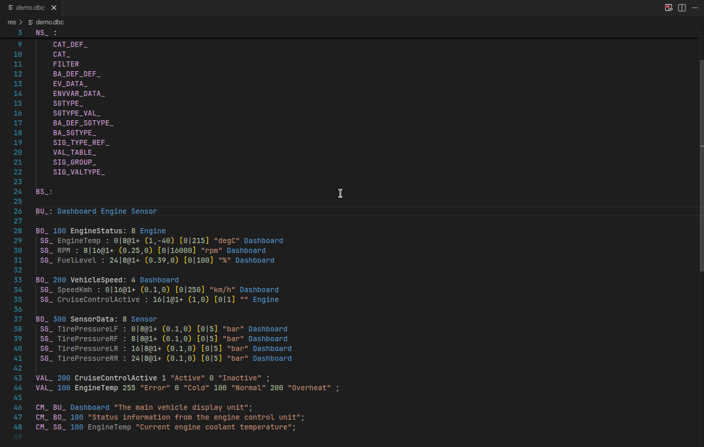

# DBC Insight

DBC Insight is a comprehensive VS Code extension for CAN Database (DBC) files. It combines a robust Language Server for real-time validation with a high-performance interactive preview panel for network visualization.

This project is a fork and major reboot of the original [DBC Language Syntax](https://github.com/Math-A-Saurus/dbc-language-syntax) extension.

## 🌟 Key Features

### 🛠️ Language Support (LSP)
- **Syntax Highlighting**: Professional, high-contrast highlighting for the complex DBC grammar.
- **Real-time Diagnostics**: Instant feedback on syntax errors and semantic inconsistencies using a custom `jison` parser.
- **Smart Snippets**: Accelerate development with built-in templates for Messages, Signals, and Nodes.

### 🌳 Network Exploration
- **Foldable Sidebar**: Navigate your CAN network through a structured tree view.
- **TX/RX Grouping**: Messages are automatically mapped to their respective Transmitting and Receiving ECUs.
- **Instant Search**: "Jump to" any node, message (Name/ID), or signal with real-time filtering.

### 📊 Advanced Visualization
- **Interactive Bit Matrix**: View signal packing in message frames. Supports both **Intel (Little Endian)** and **Motorola (Big Endian)** layouts.
- **Metadata Inspection**: Detailed property grids for all objects, including value tables (enums), scaling factors, and multi-line comments.

## 🚀 Usage
1. Open any `.dbc` file in VS Code.
2. The Language Server activates automatically to provide highlighting and linting.
3. Click the **DBC Insight** icon in the editor title bar (top right) to launch the interactive preview panel.

---

## 📸 Media & Demos

### Syntax Highlighting & Validation

*Real-time parser and lexer diagnostics.*

### Interactive Preview

*Foldable tree navigation and "Jump to" search.*

### Code Snippets

*Fast scaffolding of DBC objects.*

---

## 🛠 Project Architecture
- **`dbcLib`**: Shared TypeScript library containing data models and serialization logic.
- **`server`**: Language Server implementation providing the core IDE intelligence.
- **`client`**: Extension host and the React-based visual exploration panel.

## 🤝 Credits & Acknowledgments
DBC Insight is built upon the foundational work of **Landon Harris**, the original creator of the DBC Language Syntax extension. His implementation of the core parser and LSP structure made this reboot possible.

### Third Party Libraries
- [jison](https://github.com/zaach/jison) - Parser generator.
- [React.js](https://reactjs.org/) - Frontend UI.
- [MessagePack](https://msgpack.org/) - High-performance binary serialization.

## ⚖ License
GNU General Public License v2.0.
